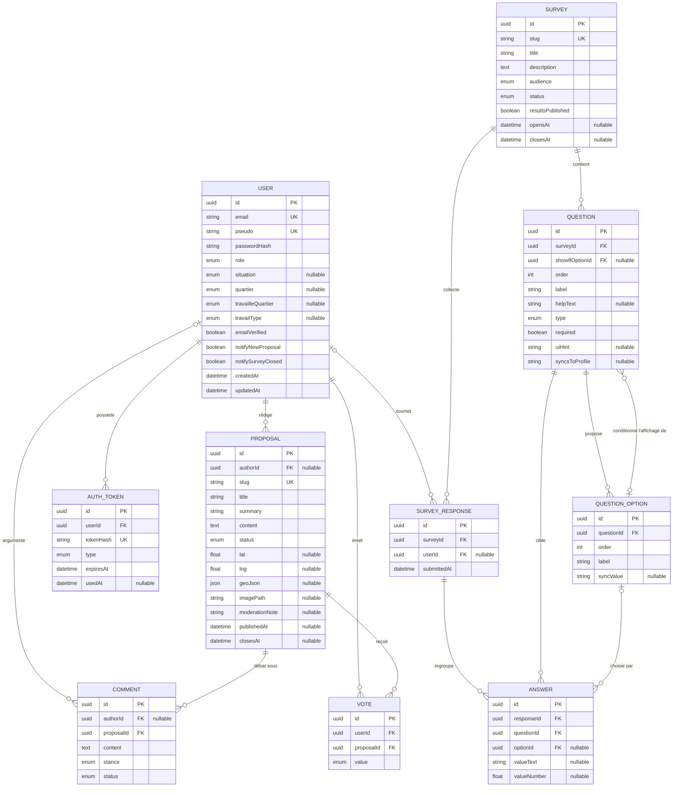

# Diagramme ERD — Senlis Participatif

> Schéma de la base de données (v1.2 — état au 23/09/2026, après la migration `add_sync_to_profile`) — source de vérité : `api/prisma/schema.prisma` du dépôt de code (copie de référence : `19-schema.prisma`).
> Légende : `||--o{` = un-à-plusieurs · `|o--o{` = la clé étrangère est **nullable** (pseudonymisation RGPD, ou lien optionnel : le lien peut être rompu sans perdre la donnée).
>
> **Ce qui a changé depuis la v1.1** (Sprint 3 et Sprint 5bis) : image de proposition (`imagePath`), code 2FA admin (`TWO_FACTOR_LOGIN`), profil déclaré du citoyen sur deux axes indépendants — résidence (`situation`, `quartier`) et travail (`travailleQuartier`, `travailType`) —, publication des résultats d'enquête soumise à l'admin (`resultsPublished`), branchement conditionnel de questions (`showIfOptionId`, relation réflexive QUESTION → QUESTION_OPTION), indicateur de rendu (`uiHint`) et synchronisation réponse → profil (`syncsToProfile` / `syncValue`).

> 💡 **La relation réflexive du branchement.** `QUESTION.showIfOptionId` pointe vers une option d'une *autre* question de la même enquête. Analogie : un panneau « Déviation — seulement si vous avez pris la sortie 3 ». Si l'option déclencheuse est supprimée, la question redevient « toujours affichée » (`SET NULL`) au lieu d'être détruite en cascade.

## Contraintes d'unicité métier (l'« isoloir numérique »)

| Table | Contrainte | Garantie |
|---|---|---|
| VOTE | `UNIQUE(userId, proposalId)` | Un citoyen = un vote par proposition |
| SURVEY_RESPONSE | `UNIQUE(userId, surveyId)` | Un citoyen = une réponse par enquête (les bulletins anonymisés, `userId = NULL`, ne se gênent pas : PostgreSQL considère deux `NULL` comme distincts) |
| ANSWER | `UNIQUE(responseId, questionId, optionId)` | Pas de double coche d'une même option |
| QUESTION | `UNIQUE(surveyId, order)` | Ordre des questions sans doublon |
| QUESTION_OPTION | `UNIQUE(questionId, order)` | Ordre des options sans doublon |

## Règles de suppression (RGPD)

| Relation | Règle | Pourquoi |
|---|---|---|
| User → Vote | CASCADE | Le vote est un acte strictement personnel |
| User → AuthToken | CASCADE | Les jetons n'ont aucun sens sans le compte |
| User → Proposal | SET NULL | Une proposition publique survit, anonymisée |
| User → Comment | SET NULL | On n'ampute pas un débat public |
| User → SurveyResponse | SET NULL | Les statistiques agrégées survivent à la désinscription |
| Proposal → Vote / Comment | CASCADE | Sans la proposition, plus d'objet |
| Survey → Question → Option → Answer | CASCADE | Suppression en chaîne d'une enquête entière |
| QuestionOption → Question (branchement) | SET NULL | Retoucher une option ne doit jamais détruire une *autre* question |

> ⚠️ **Limite RGPD à connaître** : l'anonymisation par `SET NULL` rompt le lien au compte, mais une réponse `TEXTE_LIBRE` peut elle-même contenir une donnée identifiante (« j'habite au 12 rue X »). Voir l'audit `21-audit-securite-rgpd-accessibilite.md`.
