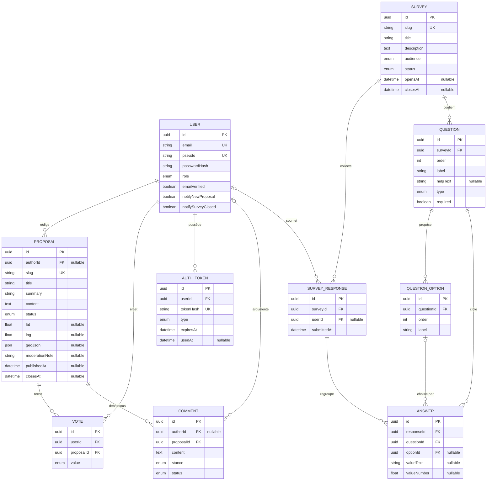

# Diagramme ERD — Senlis Participatif

> Schéma de la base de données (v1.1) — source de vérité : `schema.prisma`.
> Légende : `||--o{` = un-à-plusieurs · `|o--o{` = la clé étrangère est **nullable** (pseudonymisation RGPD : le lien au compte peut être rompu sans perdre la donnée).

## Contraintes d'unicité métier (l'« isoloir numérique »)

| Table | Contrainte | Garantie |
|---|---|---|
| VOTE | `UNIQUE(userId, proposalId)` | Un citoyen = un vote par proposition |
| SURVEY_RESPONSE | `UNIQUE(userId, surveyId)` | Un citoyen = une réponse par enquête |
| ANSWER | `UNIQUE(responseId, questionId, optionId)` | Pas de double coche d'une même option |
| QUESTION | `UNIQUE(surveyId, order)` | Ordre des questions sans doublon |
| QUESTION_OPTION | `UNIQUE(questionId, order)` | Ordre des options sans doublon |

## Règles de suppression (RGPD)

| Relation | Règle | Pourquoi |
|---|---|---|
| User → Vote | CASCADE | Le vote est un acte strictement personnel |
| User → AuthToken | CASCADE | Les jetons n'ont aucun sens sans le compte |
| User → Proposal | SET NULL | Une proposition publique survit, anonymisée |
| User → Comment | SET NULL | On n'ampute pas un débat public |
| User → SurveyResponse | SET NULL | Les statistiques agrégées survivent à la désinscription |
| Proposal → Vote / Comment | CASCADE | Sans la proposition, plus d'objet |
| Survey → Question → Option → Answer | CASCADE | Suppression en chaîne d'une enquête entière |
