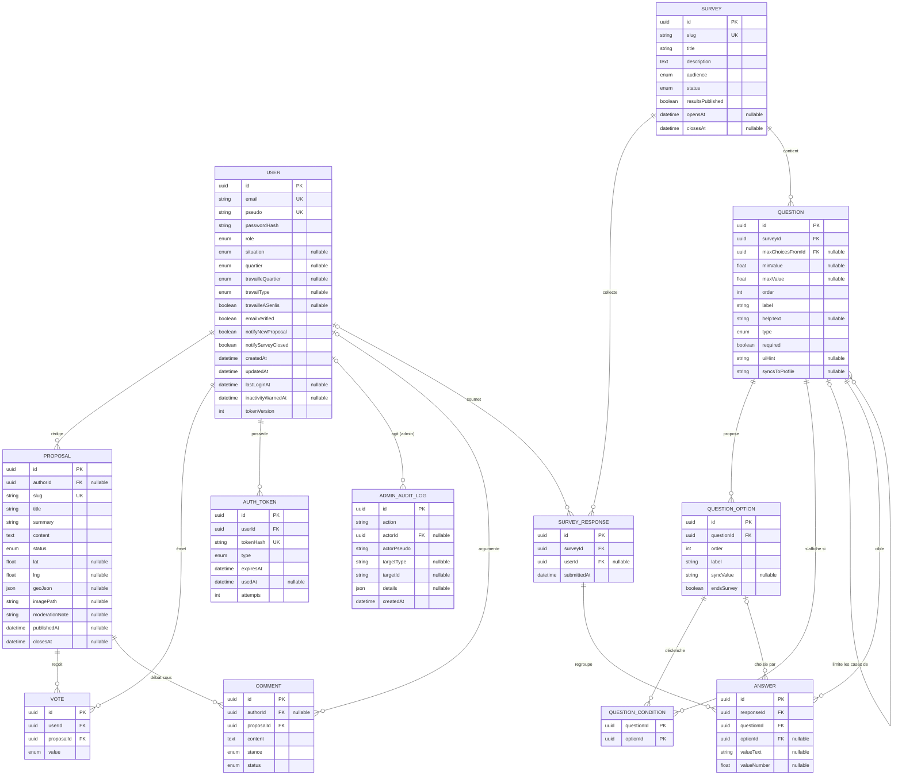

# Diagramme ERD — Senlis Participatif

> Schéma de la base de données (v1.5 — état au 03/10/2026, après la migration `survey_engine_v2` de S5R-05) — source de vérité : `api/prisma/schema.prisma` du dépôt de code (copie de référence : `19-schema.prisma`).
> Légende : `||--o{` = un-à-plusieurs · `|o--o{` = la clé étrangère est **nullable** (pseudonymisation RGPD, ou lien optionnel : le lien peut être rompu sans perdre la donnée).
>
> **Ce qui a changé depuis la v1.1** (Sprint 3 et Sprint 5bis) : image de proposition (`imagePath`), code 2FA admin (`TWO_FACTOR_LOGIN`), profil déclaré du citoyen sur deux axes indépendants — résidence (`situation`, `quartier`) et travail (`travailleQuartier`, `travailType`) —, publication des résultats d'enquête soumise à l'admin (`resultsPublished`), branchement conditionnel de questions (`showIfOptionId`, relation réflexive QUESTION → QUESTION_OPTION), indicateur de rendu (`uiHint`) et synchronisation réponse → profil (`syncsToProfile` / `syncValue`).

```mermaid
erDiagram
    USER ||--o{ PROPOSAL : "rédige"
    USER ||--o{ VOTE : "émet"
    USER ||--o{ AUTH_TOKEN : "possède"
    USER |o--o{ ADMIN_AUDIT_LOG : "agit (admin)"
    PROPOSAL ||--o{ VOTE : "reçoit"
    USER |o--o{ COMMENT : "argumente"
    PROPOSAL ||--o{ COMMENT : "débat sous"
    USER |o--o{ SURVEY_RESPONSE : "soumet"
    SURVEY ||--o{ SURVEY_RESPONSE : "collecte"
    SURVEY ||--o{ QUESTION : "contient"
    QUESTION ||--o{ QUESTION_OPTION : "propose"
    QUESTION ||--o{ QUESTION_CONDITION : "s'affiche si"
    QUESTION_OPTION ||--o{ QUESTION_CONDITION : "déclenche"
    QUESTION |o--o{ QUESTION : "limite les cases de"
    SURVEY_RESPONSE ||--o{ ANSWER : "regroupe"
    QUESTION ||--o{ ANSWER : "cible"
    QUESTION_OPTION |o--o{ ANSWER : "choisie par"

    USER {
        uuid id PK
        string email UK
        string pseudo UK
        string passwordHash
        enum role
        enum situation "nullable"
        enum quartier "nullable"
        enum travailleQuartier "nullable"
        enum travailType "nullable"
        boolean travailleASenlis "nullable"
        boolean emailVerified
        boolean notifyNewProposal
        boolean notifySurveyClosed
        datetime createdAt
        datetime updatedAt
        datetime lastLoginAt "nullable"
        datetime inactivityWarnedAt "nullable"
        int tokenVersion
    }
    AUTH_TOKEN {
        uuid id PK
        uuid userId FK
        string tokenHash UK
        enum type
        datetime expiresAt
        datetime usedAt "nullable"
        int attempts
    }
    ADMIN_AUDIT_LOG {
        uuid id PK
        string action
        uuid actorId FK "nullable"
        string actorPseudo
        string targetType "nullable"
        string targetId "nullable"
        json details "nullable"
        datetime createdAt
    }
    PROPOSAL {
        uuid id PK
        uuid authorId FK "nullable"
        string slug UK
        string title
        string summary
        text content
        enum status
        float lat "nullable"
        float lng "nullable"
        json geoJson "nullable"
        string imagePath "nullable"
        string moderationNote "nullable"
        datetime publishedAt "nullable"
        datetime closesAt "nullable"
    }
    VOTE {
        uuid id PK
        uuid userId FK
        uuid proposalId FK
        enum value
    }
    COMMENT {
        uuid id PK
        uuid authorId FK "nullable"
        uuid proposalId FK
        text content
        enum stance
        enum status
    }
    SURVEY {
        uuid id PK
        string slug UK
        string title
        text description
        enum audience
        enum status
        boolean resultsPublished
        datetime opensAt "nullable"
        datetime closesAt "nullable"
    }
    QUESTION {
        uuid id PK
        uuid surveyId FK
        uuid maxChoicesFromId FK "nullable"
        float minValue "nullable"
        float maxValue "nullable"
        int order
        string label
        string helpText "nullable"
        enum type
        boolean required
        string uiHint "nullable"
        string syncsToProfile "nullable"
    }
    QUESTION_OPTION {
        uuid id PK
        uuid questionId FK
        int order
        string label
        string syncValue "nullable"
        boolean endsSurvey
    }
    QUESTION_CONDITION {
        uuid questionId PK
        uuid optionId PK
    }
    SURVEY_RESPONSE {
        uuid id PK
        uuid surveyId FK
        uuid userId FK "nullable"
        datetime submittedAt
    }
    ANSWER {
        uuid id PK
        uuid responseId FK
        uuid questionId FK
        uuid optionId FK "nullable"
        string valueText "nullable"
        float valueNumber "nullable"
    }
```

> 💡 **Les conditions d'affichage (S5R-05).** Une question peut avoir **plusieurs** conditions, rangées dans `QUESTION_CONDITION` : elle s'affiche si **l'une d'elles** est remplie (OU). Analogie : une porte avec plusieurs badges autorisés — n'importe lequel ouvre. Si l'option déclencheuse est supprimée, seule la condition disparaît (`CASCADE` sur la table de liaison) : la question, elle, reste — « toujours affichée » s'il ne lui reste aucune condition. Avant S5R-05, une seule condition était possible (`QUESTION.showIfOptionId`, supprimé ; les anciens branchements ont été recopiés par la migration).
>
> 🔁 **`QUESTION.maxChoicesFromId`** relie une question à choix multiple à une question « Nombre » précédente : pas plus de cases cochées que la réponse donnée (ex. lieux de stationnement ≤ nombre de véhicules).

## Contraintes d'unicité métier (l'« isoloir numérique »)

| Table | Contrainte | Garantie |
|---|---|---|
| VOTE | `UNIQUE(userId, proposalId)` | Un citoyen = un vote par proposition |
| SURVEY_RESPONSE | `UNIQUE(userId, surveyId)` | Un citoyen = une réponse par enquête (les bulletins anonymisés, `userId = NULL`, ne se gênent pas : PostgreSQL considère deux `NULL` comme distincts) |
| ANSWER | `UNIQUE(responseId, questionId, optionId)` | Pas de double coche d'une même option |
| QUESTION_CONDITION | `PRIMARY KEY(questionId, optionId)` | La même condition n'est jamais enregistrée deux fois |
| QUESTION | `UNIQUE(surveyId, order)` | Ordre des questions sans doublon |
| QUESTION_OPTION | `UNIQUE(questionId, order)` | Ordre des options sans doublon |

## Règles de suppression (RGPD)

| Relation | Règle | Pourquoi |
|---|---|---|
| User → Vote | CASCADE | Le vote est un acte strictement personnel |
| User → AuthToken | CASCADE | Les jetons n'ont aucun sens sans le compte |
| User → AdminAuditLog | SET NULL | Le journal d'administration survit à son auteur (pseudo recopié) — purgé après 6 mois |
| User → Proposal | SET NULL | Une proposition publique survit, anonymisée |
| User → Comment | SET NULL | On n'ampute pas un débat public |
| User → SurveyResponse | SET NULL | Les statistiques agrégées survivent à la désinscription |
| Proposal → Vote / Comment | CASCADE | Sans la proposition, plus d'objet |
| Survey → Question → Option → Answer | CASCADE | Suppression en chaîne d'une enquête entière |
| Question / QuestionOption → QuestionCondition | CASCADE | Une condition n'a plus de sens sans sa question ou son option — la question conditionnée, elle, reste |
| Question → Question (limite de cases) | SET NULL | Supprimer la question « Nombre » de référence lève la limite, sans toucher à la question limitée |

> ⚠️ **Limite RGPD à connaître** : l'anonymisation par `SET NULL` rompt le lien au compte, mais une réponse `TEXTE_LIBRE` peut elle-même contenir une donnée identifiante (« j'habite au 12 rue X »). Voir l'audit `21-audit-securite-rgpd-accessibilite.md`.
