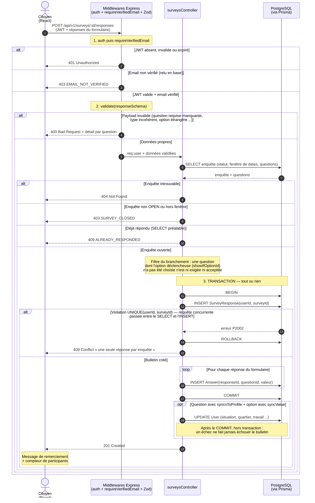

# Diagramme de séquence — Soumettre une réponse d'enquête (UC-03)

> Fonctionnalité la plus complexe du Lot 1 : elle traverse toute la chaîne (authentification → validation → règles métier → transaction) et illustre le principe directeur du projet : **le client peut mentir, l'API vérifie, la base garantit**.

## Points d'architecture illustrés

**L'ordre des middlewares n'est pas décoratif.** Authentifier *avant* de valider évite de dépenser du CPU à analyser le payload d'un anonyme ; valider *avant* le contrôleur garantit que la logique métier ne manipule que des données propres. C'est la chaîne 1 → 2 → 3 du diagramme — la même que dans Cinés-Délices.

**La transaction est la pièce maîtresse.** Un bulletin = 1 `SurveyResponse` + N `Answer`. Si l'insertion n°7 sur 10 échoue, le ROLLBACK efface tout : il est impossible d'avoir un bulletin à moitié rempli dans les statistiques. Analogie : l'urne n'accepte pas une enveloppe déchirée — c'est l'enveloppe entière ou rien.

**La vérification « déjà répondu » existe deux fois, et c'est voulu.** Le `SELECT` préalable donne un message clair dans 99,9 % des cas ; mais deux requêtes strictement simultanées peuvent passer ce contrôle toutes les deux. La contrainte `UNIQUE` rattrape alors la seconde (`P2002`), traduite elle aussi en 409 — bug réel trouvé et corrigé en cours de projet : ce cas retombait en 500. Analogie : le guichetier vérifie la liste d'émargement, mais c'est l'urne scellée qui empêche physiquement de glisser deux enveloppes.

**La synchronisation du profil vient après, jamais pendant.** Répondre « je réside dans le centre historique » met à jour le compte, mais seulement une fois le bulletin enregistré : si cette mise à jour échouait, on perdrait un profil à jour — pas une réponse d'enquête.

**Le conflit 409 n'est pas un bug, c'est la contrainte qui travaille.** La double réponse n'est pas interceptée par un `if` en JavaScript (contournable par un appel API direct ou une course entre deux requêtes simultanées) mais par la contrainte `UNIQUE(userId, surveyId)` de PostgreSQL, dernière ligne de défense infranchissable. L'API se contente de traduire l'erreur `P2002` de Prisma en réponse HTTP compréhensible.
