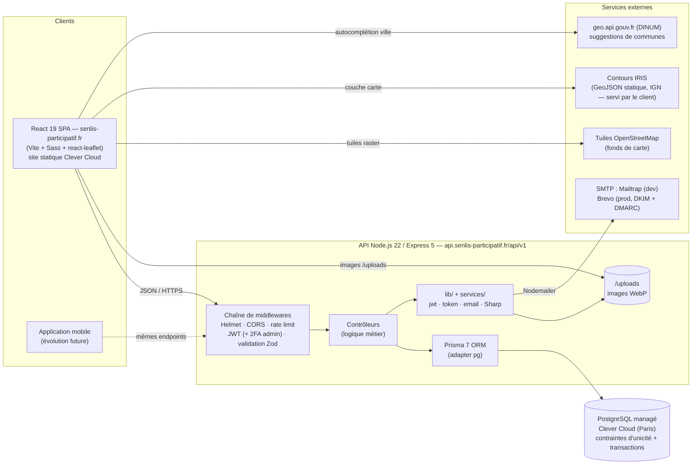

# Diagramme d'architecture — Senlis Participatif (bonus)

> Architecture découplée client / API / base de données, en monorepo (`client/` + `api/`). La règle d'or qui structure tout : **le front affiche, l'API décide, la base garantit**.
>
> **Mise à jour 23/09/2026** : hébergement souverain Clever Cloud dès le Lot 1 (Railway abandonné), domaine `senlis-participatif.fr` chez OVH, emails Brevo, API officielle `geo.api.gouv.fr` pour les suggestions de ville, images servies par l'API.

## Lecture du diagramme

**Les clients sont interchangeables.** Le site React et la future application mobile frappent à la même porte (`/api/v1`) et reçoivent le même JSON. C'est la cuisine de restaurant : la salle (web) et la livraison (mobile) sont servies par la même cuisine, avec le même menu. (La documentation Swagger du « menu » est prévue, pas encore implémentée.)

**Toute requête traverse la chaîne de sécurité dans le même ordre.** Helmet durcit les en-têtes, CORS filtre les origines (sans gêner les clients mobiles, qui n'envoient pas d'en-tête `Origin`), le rate limiting protège l'authentification de la force brute, le JWT identifie, Zod assainit. Aucun contrôleur ne voit jamais une donnée brute. Un compte admin passe en plus par un code à 6 chiffres reçu par email.

**Deux domaines, une même « famille ».** Le site (`senlis-participatif.fr`) et l'API (`api.senlis-participatif.fr`) sont deux origines différentes mais le même *site* au sens des navigateurs : c'est ce qui permet d'autoriser les images de l'API avec `Cross-Origin-Resource-Policy: same-site` (voir audit 21, §7).

**La carte ne coûte rien au serveur.** Les tuiles OpenStreetMap, les contours IRIS et les suggestions de villes sont chargés directement par le navigateur : l'API n'est sollicitée que pour les données métier. Contrepartie RGPD à assumer : l'adresse IP du visiteur est vue par OSM et par la DINUM — c'est mentionné dans la politique de confidentialité.

**Environnements.** Développement : `docker compose` (PostgreSQL, et API en option) + `vite dev`, emails capturés par Mailtrap, deux bases distinctes (dev et test). Production : Clever Cloud (France, ISO 27001, hors Cloud Act) — l'API est déployée par `git push` sans Docker, le client comme site statique avec redirection SPA vers `index.html`.
