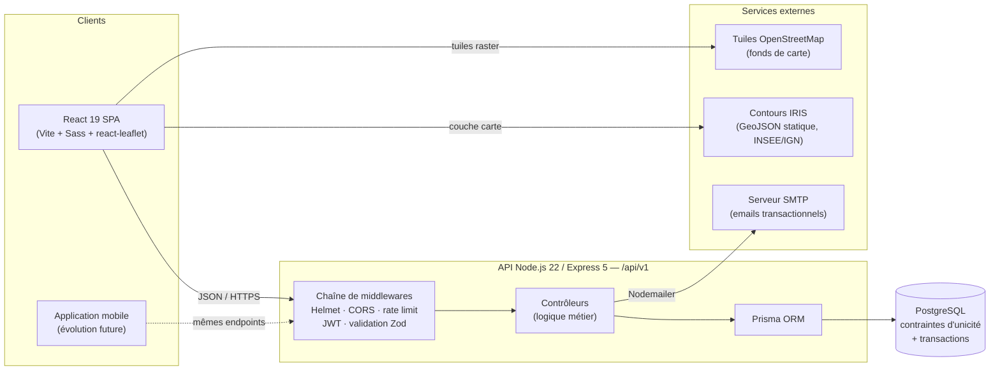

# Diagramme d'architecture — Senlis Participatif (bonus)

> Architecture découplée client / API / base de données, en monorepo (`client/` + `api/`). La règle d'or qui structure tout : **le front affiche, l'API décide, la base garantit**.

## Lecture du diagramme

**Les clients sont interchangeables.** Le site React et la future application mobile frappent à la même porte (`/api/v1`) et reçoivent le même JSON. C'est la cuisine de restaurant : la salle (web) et la livraison (mobile) sont servies par la même cuisine, avec le même menu (le contrat Swagger).

**Toute requête traverse la chaîne de sécurité dans le même ordre.** Helmet durcit les en-têtes, CORS filtre les origines (sans gêner les clients mobiles, qui n'envoient pas d'en-tête `Origin`), le rate limiting protège l'authentification de la force brute, le JWT identifie, Zod assainit. Aucun contrôleur ne voit jamais une donnée brute.

**La carte ne coûte rien au serveur.** Les tuiles OpenStreetMap et les contours IRIS sont chargés directement par le navigateur : l'API n'est sollicitée que pour les données métier (propositions, votes, enquêtes). Sobriété et performance.

**Environnements.** En développement : `docker compose` (API + PostgreSQL), front en `vite dev`. En production (Lots 1-2) : Railway. Lot 3 : migration vers un hébergeur souverain (OVHcloud / Scaleway) — l'application étant conteneurisée, la portabilité est acquise par construction.
