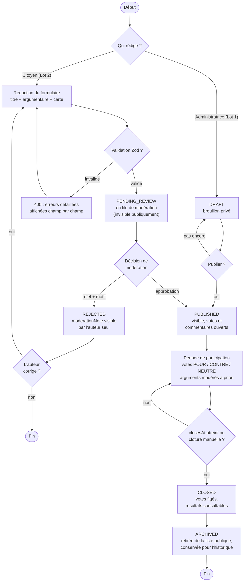

# Diagramme d'activité — Cycle de vie d'une proposition (bonus)

> Couvre les deux origines d'une proposition : créée par l'administratrice (Lot 1) ou soumise par un citoyen avec modération a priori (Lot 2). Les états rectangulaires arrondis correspondent aux valeurs de l'énumération `ProposalStatus`.

## Points de conception illustrés

**Deux portes d'entrée, un seul couloir.** Qu'elle vienne de l'administratrice ou d'un citoyen, une proposition converge vers le même état `PUBLISHED` et le même cycle de vie ensuite. Seul le chemin d'accès diffère : la version citoyenne passe obligatoirement par le sas `PENDING_REVIEW` — aucun contenu non validé ne touche jamais le public.

**Le rejet n'est pas une impasse.** La boucle `REJECTED` → correction → re-soumission, alimentée par le `moderationNote`, transforme un refus en dialogue. Une plateforme participative qui rejette sans expliquer ni offrir de seconde chance décourage précisément les gens qu'elle veut mobiliser.

**`CLOSED` ≠ `ARCHIVED`.** Une proposition close reste consultable avec ses résultats (transparence : le vote a eu lieu, chacun peut le vérifier) ; l'archivage ne fait que la retirer des listes courantes. On ne supprime jamais l'historique d'une concertation — c'est aussi un argument de sérieux face à une collectivité.
