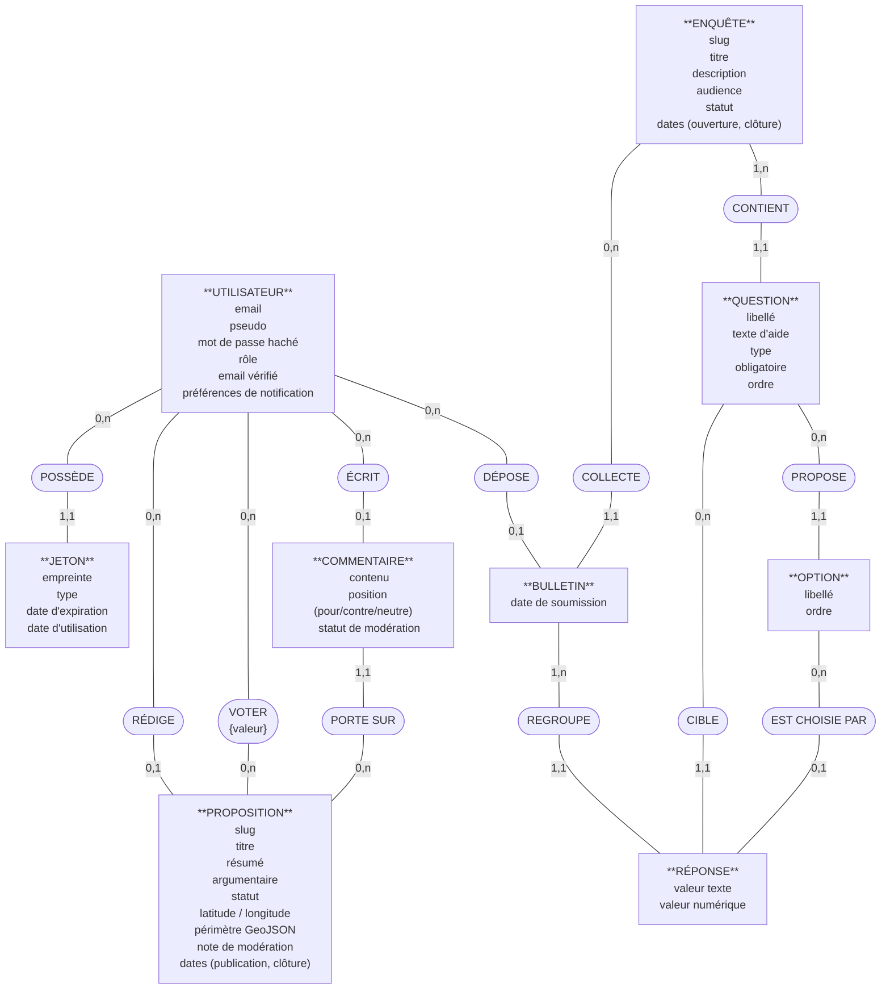

# Modélisation Merise — Senlis Participatif

> Trois niveaux, trois altitudes : le **MCD** décrit le métier (en français, sans aucun identifiant technique — on parle aux humains), le **MLD** traduit en relations (en anglais, avec clés primaires et étrangères — on parle au modèle relationnel), le **MPD** écrit le SQL (on parle à PostgreSQL).

---

## 1. MCD — Modèle Conceptuel de Données

Conventions : rectangles = **entités** (avec leurs attributs, sans identifiants) · ovales = **associations** (verbes) · cardinalités Merise `(min, max)` sur les pattes. L'association **VOTER** est *porteuse* : elle a son propre attribut (la valeur du vote).



**Lecture des cardinalités sensibles** (côté qui porte le sens métier) :

| Patte | Lecture |
|---|---|
| PROPOSITION `(0,1)` RÉDIGE | Une proposition a *au plus un* auteur — le « 0 » encode la pseudonymisation RGPD : l'auteur peut disparaître, la proposition survit |
| BULLETIN `(0,1)` DÉPOSE | Même logique : un bulletin peut devenir anonyme |
| UTILISATEUR `(0,n)` VOTER `(0,n)` PROPOSITION | Association plusieurs-à-plusieurs **porteuse** de l'attribut {valeur} — elle deviendra une table dans le MLD |
| QUESTION `(1,1)` CONTIENT | Une question appartient à *exactement une* enquête — pas de question orpheline |
| ENQUÊTE `(1,n)` CONTIENT | Une enquête contient *au moins une* question — règle métier (une enquête vide n'a pas de sens), vérifiée par l'API à l'ouverture |

---

## 2. MLD — Modèle Logique de Données

Conventions : <u>souligné</u> = clé primaire · `#préfixe` = clé étrangère · attributs en anglais `snake_case` (ils deviendront les colonnes). Règles de passage appliquées : chaque entité → une relation ; l'association porteuse VOTER → la relation `VOTE` ; les associations `(x,1)` → migration de la clé du côté `(x,n)`.

```text
USER (id, email, pseudo, password_hash, role, email_verified,
      notify_new_proposal, notify_survey_closed, created_at, updated_at)
     PK : id · UNIQUE : email · UNIQUE : pseudo

AUTH_TOKEN (id, token_hash, type, expires_at, used_at, created_at, #user_id)
     PK : id · FK : user_id → USER(id) · UNIQUE : token_hash

PROPOSAL (id, slug, title, summary, content, status, lat, lng, geo_json,
          moderation_note, created_at, published_at, closes_at, #author_id)
     PK : id · FK : author_id → USER(id) [NULLABLE] · UNIQUE : slug

VOTE (id, value, created_at, updated_at, #user_id, #proposal_id)
     PK : id · FK : user_id → USER(id) · FK : proposal_id → PROPOSAL(id)
     UNIQUE : (user_id, proposal_id)          ← issue de l'association VOTER

COMMENT (id, content, stance, status, created_at, #author_id, #proposal_id)
     PK : id · FK : author_id → USER(id) [NULLABLE]
     FK : proposal_id → PROPOSAL(id)

SURVEY (id, slug, title, description, audience, status,
        opens_at, closes_at, created_at)
     PK : id · UNIQUE : slug

QUESTION (id, label, help_text, type, required, "order", #survey_id)
     PK : id · FK : survey_id → SURVEY(id) · UNIQUE : (survey_id, "order")

QUESTION_OPTION (id, label, "order", #question_id)
     PK : id · FK : question_id → QUESTION(id) · UNIQUE : (question_id, "order")

SURVEY_RESPONSE (id, submitted_at, #survey_id, #user_id)
     PK : id · FK : survey_id → SURVEY(id)
     FK : user_id → USER(id) [NULLABLE] · UNIQUE : (user_id, survey_id)

ANSWER (id, value_text, value_number, #response_id, #question_id, #option_id)
     PK : id · FK : response_id → SURVEY_RESPONSE(id)
     FK : question_id → QUESTION(id)
     FK : option_id → QUESTION_OPTION(id) [NULLABLE]
     UNIQUE : (response_id, question_id, option_id)
```

> 💡 Remarque le destin des cardinalités `(0,1)` du MCD : elles deviennent des clés étrangères **NULLABLE** (`author_id`, `user_id`, `option_id`). Le RGPD conceptuel est devenu une propriété logique.

---

## 3. MPD — Modèle Physique de Données (PostgreSQL)

Ce que Prisma génère à partir de `schema.prisma` (`prisma migrate dev`), écrit ici à la main pour comprendre ce qui se passe sous le capot.

```sql
-- Énumérations : des "menus fixes" refusés par la base hors liste
CREATE TYPE "Role"           AS ENUM ('CITIZEN', 'ADMIN');
CREATE TYPE "ProposalStatus" AS ENUM ('DRAFT','PENDING_REVIEW','PUBLISHED',
                                      'REJECTED','CLOSED','ARCHIVED');
CREATE TYPE "VoteValue"      AS ENUM ('POUR', 'CONTRE', 'NEUTRE');
CREATE TYPE "Stance"         AS ENUM ('POUR', 'CONTRE', 'NEUTRE');
CREATE TYPE "CommentStatus"  AS ENUM ('PENDING', 'APPROVED', 'REJECTED');
CREATE TYPE "SurveyStatus"   AS ENUM ('DRAFT', 'OPEN', 'CLOSED');
CREATE TYPE "Audience"       AS ENUM ('TOUS', 'RESIDENTS', 'COMMERCANTS');
CREATE TYPE "QuestionType"   AS ENUM ('CHOIX_UNIQUE','CHOIX_MULTIPLE',
                                      'NOMBRE','OUI_NON','TEXTE_LIBRE');
CREATE TYPE "TokenType"      AS ENUM ('VERIFY_EMAIL', 'RESET_PASSWORD');

CREATE TABLE "User" (
  id                   UUID PRIMARY KEY DEFAULT gen_random_uuid(),
  email                TEXT NOT NULL UNIQUE,
  password_hash        TEXT NOT NULL,
  pseudo               TEXT NOT NULL UNIQUE,
  role                 "Role" NOT NULL DEFAULT 'CITIZEN',
  email_verified       BOOLEAN NOT NULL DEFAULT FALSE,
  notify_new_proposal  BOOLEAN NOT NULL DEFAULT TRUE,
  notify_survey_closed BOOLEAN NOT NULL DEFAULT TRUE,
  created_at           TIMESTAMPTZ NOT NULL DEFAULT now(),
  updated_at           TIMESTAMPTZ NOT NULL
);

CREATE TABLE "AuthToken" (
  id         UUID PRIMARY KEY DEFAULT gen_random_uuid(),
  token_hash TEXT NOT NULL UNIQUE,
  type       "TokenType" NOT NULL,
  expires_at TIMESTAMPTZ NOT NULL,
  used_at    TIMESTAMPTZ,
  user_id    UUID NOT NULL REFERENCES "User"(id) ON DELETE CASCADE,
  created_at TIMESTAMPTZ NOT NULL DEFAULT now()
);

CREATE TABLE "Proposal" (
  id              UUID PRIMARY KEY DEFAULT gen_random_uuid(),
  slug            TEXT NOT NULL UNIQUE,
  title           TEXT NOT NULL,
  summary         TEXT NOT NULL,
  content         TEXT NOT NULL,
  status          "ProposalStatus" NOT NULL DEFAULT 'DRAFT',
  lat             DOUBLE PRECISION,
  lng             DOUBLE PRECISION,
  geo_json        JSONB,                -- périmètre Leaflet, JSONB = indexable
  moderation_note TEXT,
  author_id       UUID REFERENCES "User"(id) ON DELETE SET NULL,  -- RGPD
  created_at      TIMESTAMPTZ NOT NULL DEFAULT now(),
  published_at    TIMESTAMPTZ,
  closes_at       TIMESTAMPTZ
);

CREATE TABLE "Vote" (
  id          UUID PRIMARY KEY DEFAULT gen_random_uuid(),
  value       "VoteValue" NOT NULL,
  user_id     UUID NOT NULL REFERENCES "User"(id)     ON DELETE CASCADE,
  proposal_id UUID NOT NULL REFERENCES "Proposal"(id) ON DELETE CASCADE,
  created_at  TIMESTAMPTZ NOT NULL DEFAULT now(),
  updated_at  TIMESTAMPTZ NOT NULL,
  CONSTRAINT vote_isoloir UNIQUE (user_id, proposal_id)  -- ⭐ un vote/personne
);

CREATE TABLE "Comment" (
  id          UUID PRIMARY KEY DEFAULT gen_random_uuid(),
  content     TEXT NOT NULL,
  stance      "Stance" NOT NULL,
  status      "CommentStatus" NOT NULL DEFAULT 'PENDING',
  author_id   UUID REFERENCES "User"(id) ON DELETE SET NULL,      -- RGPD
  proposal_id UUID NOT NULL REFERENCES "Proposal"(id) ON DELETE CASCADE,
  created_at  TIMESTAMPTZ NOT NULL DEFAULT now()
);

CREATE TABLE "Survey" (
  id          UUID PRIMARY KEY DEFAULT gen_random_uuid(),
  slug        TEXT NOT NULL UNIQUE,
  title       TEXT NOT NULL,
  description TEXT NOT NULL,
  audience    "Audience" NOT NULL DEFAULT 'TOUS',
  status      "SurveyStatus" NOT NULL DEFAULT 'DRAFT',
  opens_at    TIMESTAMPTZ,
  closes_at   TIMESTAMPTZ,
  created_at  TIMESTAMPTZ NOT NULL DEFAULT now()
);

CREATE TABLE "Question" (
  id        UUID PRIMARY KEY DEFAULT gen_random_uuid(),
  label     TEXT NOT NULL,
  help_text TEXT,
  type      "QuestionType" NOT NULL,
  required  BOOLEAN NOT NULL DEFAULT TRUE,
  "order"   INTEGER NOT NULL,            -- mot réservé SQL → guillemets
  survey_id UUID NOT NULL REFERENCES "Survey"(id) ON DELETE CASCADE,
  CONSTRAINT question_rang UNIQUE (survey_id, "order")
);

CREATE TABLE "QuestionOption" (
  id          UUID PRIMARY KEY DEFAULT gen_random_uuid(),
  label       TEXT NOT NULL,
  "order"     INTEGER NOT NULL,
  question_id UUID NOT NULL REFERENCES "Question"(id) ON DELETE CASCADE,
  CONSTRAINT option_rang UNIQUE (question_id, "order")
);

CREATE TABLE "SurveyResponse" (
  id           UUID PRIMARY KEY DEFAULT gen_random_uuid(),
  submitted_at TIMESTAMPTZ NOT NULL DEFAULT now(),
  survey_id    UUID NOT NULL REFERENCES "Survey"(id) ON DELETE CASCADE,
  user_id      UUID REFERENCES "User"(id) ON DELETE SET NULL,  -- pseudonymisation
  CONSTRAINT reponse_isoloir UNIQUE (user_id, survey_id)  -- ⭐ une réponse/enquête
);

CREATE TABLE "Answer" (
  id           UUID PRIMARY KEY DEFAULT gen_random_uuid(),
  value_text   TEXT,
  value_number DOUBLE PRECISION,
  response_id  UUID NOT NULL REFERENCES "SurveyResponse"(id) ON DELETE CASCADE,
  question_id  UUID NOT NULL REFERENCES "Question"(id)       ON DELETE CASCADE,
  option_id    UUID REFERENCES "QuestionOption"(id)          ON DELETE CASCADE,
  CONSTRAINT answer_unique UNIQUE (response_id, question_id, option_id)
);

-- Index de confort pour les requêtes fréquentes (listes et agrégats)
CREATE INDEX idx_proposal_status   ON "Proposal"(status);
CREATE INDEX idx_comment_proposal  ON "Comment"(proposal_id, status);
CREATE INDEX idx_answer_question   ON "Answer"(question_id);
```

> 🎓 Du MCD au MPD, observe la trajectoire d'une seule idée : « *un citoyen ne vote qu'une fois* ». Au MCD c'est une association VOTER `(0,n)-(0,n)` porteuse ; au MLD c'est la relation VOTE avec son `UNIQUE(user_id, proposal_id)` ; au MPD c'est la contrainte `vote_isoloir` que PostgreSQL oppose à toute insertion frauduleuse. Trois langages, une seule règle métier.
