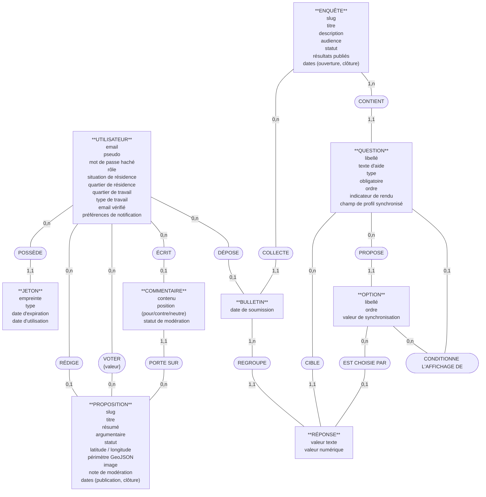

# Modélisation Merise — Senlis Participatif

> Trois niveaux, trois altitudes : le **MCD** décrit le métier (en français, sans aucun identifiant technique — on parle aux humains), le **MLD** traduit en relations (en anglais, avec clés primaires et étrangères — on parle au modèle relationnel), le **MPD** écrit le SQL (on parle à PostgreSQL).

---

## 1. MCD — Modèle Conceptuel de Données

Conventions : rectangles = **entités** (avec leurs attributs, sans identifiants) · ovales = **associations** (verbes) · cardinalités Merise `(min, max)` sur les pattes. L'association **VOTER** est *porteuse* : elle a son propre attribut (la valeur du vote).



**Lecture des cardinalités sensibles** (côté qui porte le sens métier) :

| Patte | Lecture |
|---|---|
| PROPOSITION `(0,1)` RÉDIGE | Une proposition a *au plus un* auteur — le « 0 » encode la pseudonymisation RGPD : l'auteur peut disparaître, la proposition survit |
| BULLETIN `(0,1)` DÉPOSE | Même logique : un bulletin peut devenir anonyme |
| UTILISATEUR `(0,n)` VOTER `(0,n)` PROPOSITION | Association plusieurs-à-plusieurs **porteuse** de l'attribut {valeur} — elle deviendra une table dans le MLD |
| QUESTION `(1,1)` CONTIENT | Une question appartient à *exactement une* enquête — pas de question orpheline |
| QUESTION `(0,1)` CONDITIONNE | Branchement : une question dépend *au plus d'une* option d'une question antérieure (limite assumée : pas de « ET » entre deux conditions) ; `0` = toujours affichée |
| ENQUÊTE `(1,n)` CONTIENT | Une enquête contient *au moins une* question — règle métier (une enquête vide n'a pas de sens), vérifiée par l'API à l'ouverture |

---

## 2. MLD — Modèle Logique de Données

Conventions : <u>souligné</u> = clé primaire · `#préfixe` = clé étrangère · noms en anglais, écrits **comme dans la base réelle** (Prisma conserve le `camelCase` du schéma : pas de `@map`, donc pas de `snake_case`). Règles de passage appliquées : chaque entité → une relation ; l'association porteuse VOTER → la relation `Vote` ; les associations `(x,1)` → migration de la clé du côté `(x,n)`.

```text
User (id, email, pseudo, passwordHash, role, situation, quartier,
      travailleQuartier, travailType, emailVerified,
      notifyNewProposal, notifySurveyClosed, createdAt, updatedAt)
     PK : id · UNIQUE : email · UNIQUE : pseudo

AuthToken (id, tokenHash, type, expiresAt, usedAt, createdAt, #userId)
     PK : id · FK : userId → User(id) · UNIQUE : tokenHash

Proposal (id, slug, title, summary, content, status, lat, lng, geoJson,
          imagePath, moderationNote, createdAt, publishedAt, closesAt, #authorId)
     PK : id · FK : authorId → User(id) [NULLABLE] · UNIQUE : slug

Vote (id, value, createdAt, updatedAt, #userId, #proposalId)
     PK : id · FK : userId → User(id) · FK : proposalId → Proposal(id)
     UNIQUE : (userId, proposalId)          ← issue de l'association VOTER

Comment (id, content, stance, status, createdAt, #authorId, #proposalId)
     PK : id · FK : authorId → User(id) [NULLABLE]
     FK : proposalId → Proposal(id)

Survey (id, slug, title, description, audience, status, resultsPublished,
        opensAt, closesAt, createdAt)
     PK : id · UNIQUE : slug

Question (id, label, helpText, type, required, "order", uiHint,
          syncsToProfile, #surveyId, #showIfOptionId)
     PK : id · FK : surveyId → Survey(id) · UNIQUE : (surveyId, "order")
     FK : showIfOptionId → QuestionOption(id) [NULLABLE]   ← association CONDITIONNE

QuestionOption (id, label, "order", syncValue, #questionId)
     PK : id · FK : questionId → Question(id) · UNIQUE : (questionId, "order")

SurveyResponse (id, submittedAt, #surveyId, #userId)
     PK : id · FK : surveyId → Survey(id)
     FK : userId → User(id) [NULLABLE] · UNIQUE : (userId, surveyId)

Answer (id, valueText, valueNumber, #responseId, #questionId, #optionId)
     PK : id · FK : responseId → SurveyResponse(id)
     FK : questionId → Question(id)
     FK : optionId → QuestionOption(id) [NULLABLE]
     UNIQUE : (responseId, questionId, optionId)
```

> 💡 Remarque le destin des cardinalités `(0,1)` du MCD : elles deviennent des clés étrangères **NULLABLE** (`authorId`, `userId`, `optionId`, `showIfOptionId`). Le RGPD conceptuel est devenu une propriété logique.
>
> 🔁 **Question ↔ QuestionOption forment un cycle** (une question possède des options, et peut dépendre de l'option d'une autre question). C'est pourquoi le constructeur d'enquête crée d'abord toutes les questions et options, *puis* renseigne `showIfOptionId` dans un second temps — on ne peut pas pointer vers une option qui n'existe pas encore.

---

## 3. MPD — Modèle Physique de Données (PostgreSQL)

Reconstitution **fidèle** (réordonnée pour la lecture) de ce que génèrent les migrations Prisma (`api/prisma/migrations/`, 9 migrations du 15/06 au 22/09/2026), cumulées. Trois différences avec un SQL « écrit à la main » à connaître :

1. **Identifiants en `TEXT`**, pas en `UUID` : `@default(uuid())` génère l'UUID **dans Node** (Prisma), pas dans PostgreSQL (`gen_random_uuid()` n'est jamais appelé).
2. **Noms entre guillemets en `camelCase`** (`"passwordHash"`) : sans guillemets, PostgreSQL mettrait tout en minuscules.
3. **Dates en `TIMESTAMP(3)`** (millisecondes, sans fuseau — Prisma écrit toujours en UTC), `updatedAt` rempli par Prisma.

```sql
-- Énumérations : des "menus fixes" refusés par la base hors liste
CREATE TYPE "Role"           AS ENUM ('CITIZEN', 'ADMIN');
CREATE TYPE "ProposalStatus" AS ENUM ('DRAFT','PENDING_REVIEW','PUBLISHED',
                                      'REJECTED','CLOSED','ARCHIVED');
CREATE TYPE "CommentStatus"  AS ENUM ('PENDING', 'APPROVED', 'REJECTED');
CREATE TYPE "Stance"         AS ENUM ('POUR', 'CONTRE', 'NEUTRE');
CREATE TYPE "TokenType"      AS ENUM ('VERIFY_EMAIL', 'RESET_PASSWORD', 'TWO_FACTOR_LOGIN');
CREATE TYPE "VoteValue"      AS ENUM ('POUR', 'CONTRE', 'NEUTRE');
CREATE TYPE "SurveyStatus"   AS ENUM ('DRAFT', 'OPEN', 'CLOSED');
CREATE TYPE "Audience"       AS ENUM ('TOUS', 'RESIDENTS', 'COMMERCANTS');
CREATE TYPE "QuestionType"   AS ENUM ('CHOIX_UNIQUE','CHOIX_MULTIPLE',
                                      'NOMBRE','OUI_NON','TEXTE_LIBRE');
CREATE TYPE "Situation"      AS ENUM ('CENTRE_RESIDENT', 'AUTRE_QUARTIER', 'HORS_SENLIS');
CREATE TYPE "Quartier"       AS ENUM ('BRICHEBAY','BON_SECOURS','VAL_AUNETTE_GATELIERE',
                                      'ZONE_INDUSTRIELLE','VILLEVERT','JARDINIERS',
                                      'CENTRE_HISTORIQUE');
CREATE TYPE "TravailType"    AS ENUM ('COMMERCANT', 'SALARIE');

CREATE TABLE "User" (
  "id"                 TEXT NOT NULL PRIMARY KEY,
  "email"              TEXT NOT NULL,
  "passwordHash"       TEXT NOT NULL,
  "pseudo"             TEXT NOT NULL,
  "role"               "Role" NOT NULL DEFAULT 'CITIZEN',
  "situation"          "Situation",
  "quartier"           "Quartier",
  "travailleQuartier"  "Quartier",
  "travailType"        "TravailType",
  "emailVerified"      BOOLEAN NOT NULL DEFAULT false,
  "notifyNewProposal"  BOOLEAN NOT NULL DEFAULT true,
  "notifySurveyClosed" BOOLEAN NOT NULL DEFAULT true,
  "createdAt"          TIMESTAMP(3) NOT NULL DEFAULT CURRENT_TIMESTAMP,
  "updatedAt"          TIMESTAMP(3) NOT NULL
);
CREATE UNIQUE INDEX "User_email_key"  ON "User"("email");
CREATE UNIQUE INDEX "User_pseudo_key" ON "User"("pseudo");

CREATE TABLE "AuthToken" (
  "id"        TEXT NOT NULL PRIMARY KEY,
  "tokenHash" TEXT NOT NULL,
  "type"      "TokenType" NOT NULL,
  "expiresAt" TIMESTAMP(3) NOT NULL,
  "usedAt"    TIMESTAMP(3),
  "userId"    TEXT NOT NULL REFERENCES "User"("id") ON DELETE CASCADE ON UPDATE CASCADE,
  "createdAt" TIMESTAMP(3) NOT NULL DEFAULT CURRENT_TIMESTAMP
);
CREATE UNIQUE INDEX "AuthToken_tokenHash_key" ON "AuthToken"("tokenHash");

CREATE TABLE "Proposal" (
  "id"             TEXT NOT NULL PRIMARY KEY,
  "slug"           TEXT NOT NULL,
  "title"          TEXT NOT NULL,
  "summary"        TEXT NOT NULL,
  "content"        TEXT NOT NULL,
  "status"         "ProposalStatus" NOT NULL DEFAULT 'DRAFT',
  "lat"            DOUBLE PRECISION,
  "lng"            DOUBLE PRECISION,
  "geoJson"        JSONB,
  "imagePath"      TEXT,
  "authorId"       TEXT REFERENCES "User"("id") ON DELETE SET NULL ON UPDATE CASCADE,  -- RGPD
  "moderationNote" TEXT,
  "createdAt"      TIMESTAMP(3) NOT NULL DEFAULT CURRENT_TIMESTAMP,
  "publishedAt"    TIMESTAMP(3),
  "closesAt"       TIMESTAMP(3)
);
CREATE UNIQUE INDEX "Proposal_slug_key" ON "Proposal"("slug");

CREATE TABLE "Vote" (
  "id"         TEXT NOT NULL PRIMARY KEY,
  "value"      "VoteValue" NOT NULL,
  "userId"     TEXT NOT NULL REFERENCES "User"("id")     ON DELETE CASCADE ON UPDATE CASCADE,
  "proposalId" TEXT NOT NULL REFERENCES "Proposal"("id") ON DELETE CASCADE ON UPDATE CASCADE,
  "createdAt"  TIMESTAMP(3) NOT NULL DEFAULT CURRENT_TIMESTAMP,
  "updatedAt"  TIMESTAMP(3) NOT NULL
);
-- ⭐ l'isoloir : un vote par personne et par proposition
CREATE UNIQUE INDEX "Vote_userId_proposalId_key" ON "Vote"("userId", "proposalId");

CREATE TABLE "Comment" (
  "id"         TEXT NOT NULL PRIMARY KEY,
  "content"    TEXT NOT NULL,
  "stance"     "Stance" NOT NULL,
  "status"     "CommentStatus" NOT NULL DEFAULT 'PENDING',
  "authorId"   TEXT REFERENCES "User"("id") ON DELETE SET NULL ON UPDATE CASCADE,      -- RGPD
  "proposalId" TEXT NOT NULL REFERENCES "Proposal"("id") ON DELETE CASCADE ON UPDATE CASCADE,
  "createdAt"  TIMESTAMP(3) NOT NULL DEFAULT CURRENT_TIMESTAMP
);

CREATE TABLE "Survey" (
  "id"               TEXT NOT NULL PRIMARY KEY,
  "slug"             TEXT NOT NULL,
  "title"            TEXT NOT NULL,
  "description"      TEXT NOT NULL,
  "audience"         "Audience" NOT NULL DEFAULT 'TOUS',
  "status"           "SurveyStatus" NOT NULL DEFAULT 'DRAFT',
  "resultsPublished" BOOLEAN NOT NULL DEFAULT false,
  "opensAt"          TIMESTAMP(3),
  "closesAt"         TIMESTAMP(3),
  "createdAt"        TIMESTAMP(3) NOT NULL DEFAULT CURRENT_TIMESTAMP
);
CREATE UNIQUE INDEX "Survey_slug_key" ON "Survey"("slug");

CREATE TABLE "Question" (
  "id"             TEXT NOT NULL PRIMARY KEY,
  "label"          TEXT NOT NULL,
  "helpText"       TEXT,
  "type"           "QuestionType" NOT NULL,
  "required"       BOOLEAN NOT NULL DEFAULT true,
  "order"          INTEGER NOT NULL,          -- mot réservé SQL → guillemets
  "uiHint"         TEXT,
  "syncsToProfile" TEXT,
  "showIfOptionId" TEXT,                       -- FK ajoutée après QuestionOption (cycle)
  "surveyId"       TEXT NOT NULL REFERENCES "Survey"("id") ON DELETE CASCADE ON UPDATE CASCADE
);
CREATE UNIQUE INDEX "Question_surveyId_order_key" ON "Question"("surveyId", "order");

CREATE TABLE "QuestionOption" (
  "id"         TEXT NOT NULL PRIMARY KEY,
  "label"      TEXT NOT NULL,
  "order"      INTEGER NOT NULL,
  "syncValue"  TEXT,
  "questionId" TEXT NOT NULL REFERENCES "Question"("id") ON DELETE CASCADE ON UPDATE CASCADE
);
CREATE UNIQUE INDEX "QuestionOption_questionId_order_key" ON "QuestionOption"("questionId", "order");

-- Le branchement : ajouté une fois les deux tables créées
ALTER TABLE "Question" ADD CONSTRAINT "Question_showIfOptionId_fkey"
  FOREIGN KEY ("showIfOptionId") REFERENCES "QuestionOption"("id")
  ON DELETE SET NULL ON UPDATE CASCADE;

CREATE TABLE "SurveyResponse" (
  "id"          TEXT NOT NULL PRIMARY KEY,
  "submittedAt" TIMESTAMP(3) NOT NULL DEFAULT CURRENT_TIMESTAMP,
  "surveyId"    TEXT NOT NULL REFERENCES "Survey"("id") ON DELETE CASCADE ON UPDATE CASCADE,
  "userId"      TEXT REFERENCES "User"("id") ON DELETE SET NULL ON UPDATE CASCADE  -- pseudonymisation
);
-- ⭐ une réponse par citoyen et par enquête (deux NULL sont distincts :
--    les bulletins anonymisés ne se bloquent pas entre eux)
CREATE UNIQUE INDEX "SurveyResponse_userId_surveyId_key" ON "SurveyResponse"("userId", "surveyId");

CREATE TABLE "Answer" (
  "id"          TEXT NOT NULL PRIMARY KEY,
  "valueText"   TEXT,
  "valueNumber" DOUBLE PRECISION,
  "responseId"  TEXT NOT NULL REFERENCES "SurveyResponse"("id") ON DELETE CASCADE ON UPDATE CASCADE,
  "questionId"  TEXT NOT NULL REFERENCES "Question"("id")       ON DELETE CASCADE ON UPDATE CASCADE,
  "optionId"    TEXT REFERENCES "QuestionOption"("id")          ON DELETE CASCADE ON UPDATE CASCADE
);
CREATE UNIQUE INDEX "Answer_responseId_questionId_optionId_key"
  ON "Answer"("responseId", "questionId", "optionId");
```

> 📈 **Index non encore créés** (pistes d'optimisation, à ajouter via `@@index` dans `schema.prisma` si les volumes le justifient) : `Proposal(status)` pour les listes filtrées, `Comment(proposalId, status)` pour le Lot 2, `Answer(questionId)` pour les agrégats. PostgreSQL n'indexe **pas** automatiquement les clés étrangères.

> 🎓 Du MCD au MPD, observe la trajectoire d'une seule idée : « *un citoyen ne vote qu'une fois* ». Au MCD c'est une association VOTER `(0,n)-(0,n)` porteuse ; au MLD c'est la relation `Vote` avec son `UNIQUE(userId, proposalId)` ; au MPD c'est l'index unique `Vote_userId_proposalId_key` que PostgreSQL oppose à toute insertion frauduleuse. Trois langages, une seule règle métier.
