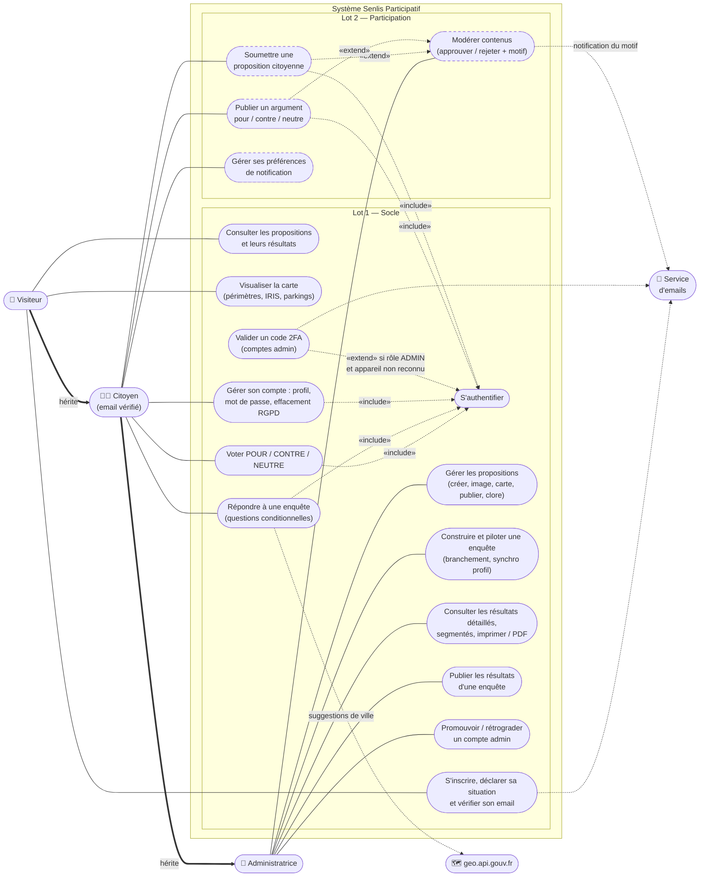

# Diagramme des cas d'utilisation — Senlis Participatif

> Vue UML d'ensemble : *qui* peut faire *quoi*. Les acteurs héritent les uns des autres (un Citoyen peut tout ce que peut un Visiteur ; l'Administratrice peut tout ce que peut un Citoyen). Les ovales pointillés = Lot 2. `«include»` = passage obligé ; `«extend»` = comportement optionnel.
>
> **Mise à jour 23/09/2026** : ajout de la double authentification admin, du profil déclaré (résidence / travail), de la publication et de la segmentation des résultats, et de la gestion des comptes.

**Lectures utiles**
- L'« include » systématique vers **S'authentifier** matérialise la règle : aucune participation sans compte vérifié — c'est le socle de la crédibilité statistique.
- **Valider un code 2FA** *étend* l'authentification : il ne s'ajoute que pour un compte admin, et seulement si ce navigateur n'a pas déjà réussi un code dans l'heure (appareil de confiance). Analogie : le coffre de la banque demande une seconde clé, pas la porte d'entrée.
- **Publier les résultats** est distinct de **clore l'enquête** : l'administratrice peut analyser des résultats clos avant de les rendre publics.
- Les deux « extend » vers **Modérer** disent la modération *a priori* (Lot 2).
- Le **Service d'emails** et **geo.api.gouv.fr** sont des acteurs secondaires : le système les appelle, ils ne décident rien. Emails : Mailtrap en dev, Brevo en production.
