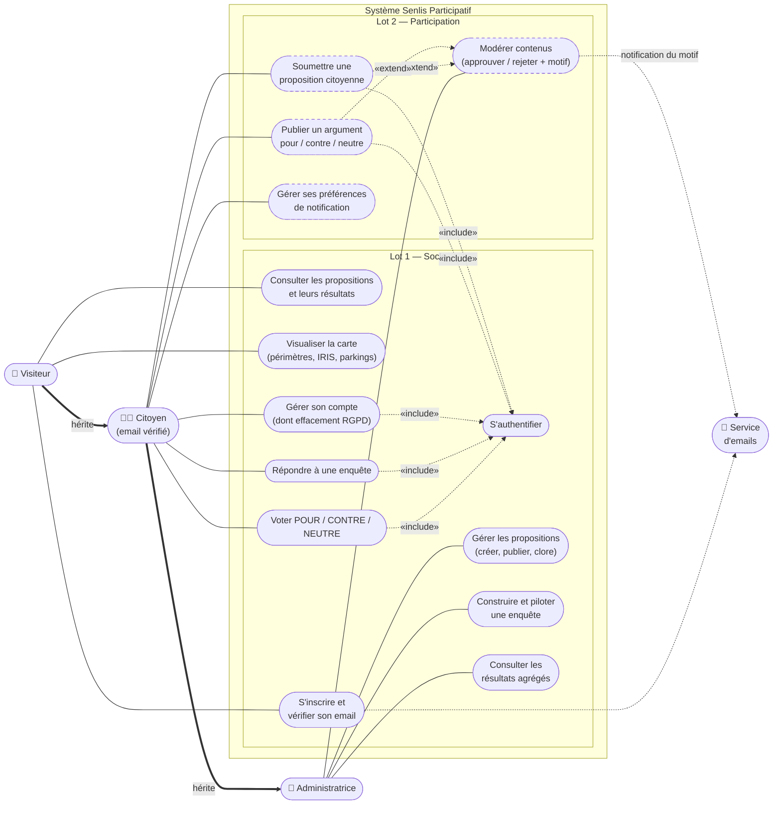

# Diagramme des cas d'utilisation — Senlis Participatif

> Vue UML d'ensemble : *qui* peut faire *quoi*. Les acteurs héritent les uns des autres (un Citoyen peut tout ce que peut un Visiteur ; l'Administratrice peut tout ce que peut un Citoyen). Les ovales pointillés = Lot 2. `«include»` = passage obligé ; `«extend»` = comportement optionnel.

**Lectures utiles**
- L'« include » systématique vers **S'authentifier** matérialise la règle : aucune participation sans compte vérifié — c'est le socle de la crédibilité statistique.
- Les deux « extend » vers **Modérer** disent la modération *a priori* : publier un argument ou soumettre une proposition déclenche potentiellement une modération avant toute visibilité.
- Le **Service d'emails** est un acteur secondaire (le système l'appelle, il ne décide rien) : vérification d'inscription, motif de rejet… En dev : Mailtrap ; en production : Brevo.
