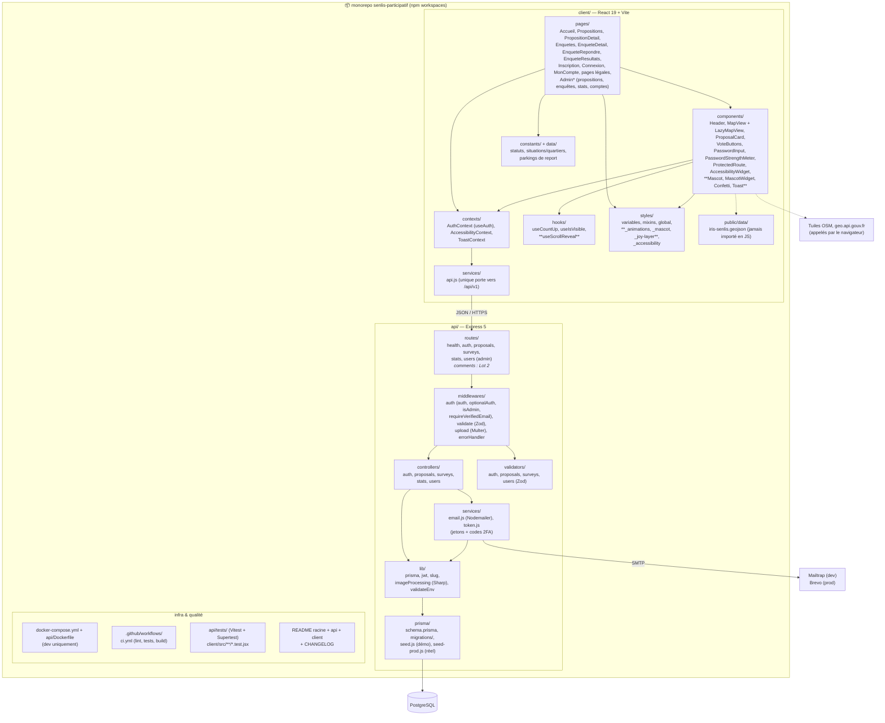

# Diagramme de packages — Senlis Participatif

> Organisation du monorepo : qui dépend de qui. La règle des flèches : elles pointent toujours **vers le bas de la pile** (un contrôleur utilise un service, jamais l'inverse) — c'est ce qui rend chaque couche testable isolément. Même découpage que Cinés-Délices.
>
> **Mise à jour 23/09/2026** : aligné sur l'arborescence réelle de la branche `dev` (les packages prévus mais pas encore créés sont signalés « Lot 2 »).

**Cinq décisions encodées dans ce découpage**

1. **`services/api.js` est l'unique porte de sortie du client** : aucun composant React ne fait de `fetch` vers l'API directement. Le jour où l'API change (v2, en-têtes, gestion d'erreurs), un seul fichier bouge. (Seule exception assumée : l'autocomplétion de ville appelle `geo.api.gouv.fr`, une API tierce publique, depuis `EnqueteRepondre.jsx`.)
2. **`services/email.js` ne connaît pas Mailtrap ni Brevo** : il lit `SMTP_HOST`, `SMTP_USER`, etc. depuis l'environnement. Passer de la boîte de test au vrai envoi = changer le `.env`, zéro ligne de code — et `lib/validateEnv.js` refuse de démarrer en production si l'on a oublié.
3. **`validators/` est séparé des contrôleurs** : les schémas Zod sont réutilisables (le même schéma valide la requête ET sert de contrat dans les tests d'intégration).
4. **`lib/` regroupe les outils sans logique métier** (client Prisma unique, signature JWT, slug, traitement d'image) : ce sont les « outils de l'atelier », partagés par tous les établis (contrôleurs).
5. **La mascotte est un pur composant front** : `Mascot.jsx`, `MascotWidget.jsx`, `_mascot.scss` et `_animations.scss`. Zéro impact sur l'API ou la base de données — le cerf ne traverse jamais la frontière `services/api.js`.

**Fichiers spécifiques à l'expérience joyeuse et à l'accessibilité** (dans `styles/`)

| Fichier | Rôle |
|---|---|
| `_animations.scss` | Keyframes centralisés : blink, earWiggle, tailWag, bubblePop, float, pulse, confettiFall |
| `_mascot.scss` | Styles du cerf : tailles (hero/section/inline/widget), poses, bulles |
| `_joy-layer.scss` | Sections colorées, séparateurs ondulés, stat pills, jauge de vote |
| `_accessibility.scss` | Classes appliquées par le widget d'accessibilité (contrastes, taille du texte, monochrome, grille de lecture…) |

**Hook `useScrollReveal`** : encapsule un `IntersectionObserver` pour déclencher les animations au scroll (jauges, compteurs). Respecte `prefers-reduced-motion`.
