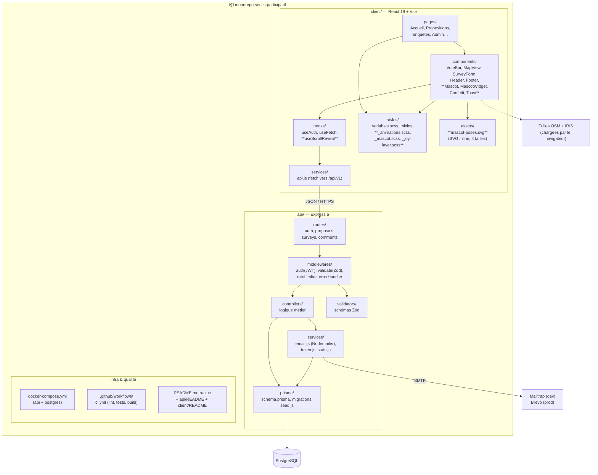

# Diagramme de packages — Senlis Participatif

> Organisation du monorepo : qui dépend de qui. La règle des flèches : elles pointent toujours **vers le bas de la pile** (un contrôleur utilise un service, jamais l'inverse) — c'est ce qui rend chaque couche testable isolément. Même découpage que Cinés-Délices.

**Quatre décisions encodées dans ce découpage**

1. **`services/api.js` est l'unique porte de sortie du client** : aucun composant React ne fait de `fetch` direct. Le jour où l'API change (v2, en-têtes, gestion d'erreurs), un seul fichier bouge.
2. **`services/email.js` ne connaît pas Mailtrap ni Brevo** : il lit `SMTP_HOST`, `SMTP_USER`, etc. depuis l'environnement. Passer de la boîte de test au vrai envoi = changer le `.env`, zéro ligne de code.
3. **`validators/` est séparé des contrôleurs** : les schémas Zod sont réutilisables (le même schéma valide la requête ET sert de contrat dans les tests d'intégration).
4. **La mascotte est un pur composant front** : `Mascot.jsx` (SVG inline, 4 tailles), `MascotWidget.jsx` (panneau guide-citoyen), `_mascot.scss` et `_animations.scss` (poses et transitions). Zéro impact sur l'API ou la base de données — le cerf ne traverse jamais la frontière `services/api.js`.

**Fichiers spécifiques à l'expérience joyeuse** (dans `styles/`)

| Fichier | Rôle |
|---|---|
| `_animations.scss` | Keyframes centralisés : blink, earWiggle, tailWag, bubblePop, float, pulse, confettiFall — chaque animation est nommée et documentée |
| `_mascot.scss` | Styles spécifiques au cerf : tailles (hero/section/inline/widget), poses, bulles de parole |
| `_joy-layer.scss` | Sections colorées (fonds pastel + dégradés), séparateurs ondulés, stat pills, effets de survol renforcés — le « joy layer » qui se pose par-dessus la structure fonctionnelle |

**Hook `useScrollReveal`** : encapsule un `IntersectionObserver` pour déclencher les animations au scroll (jauges de vote, compteurs, barres de progression). Accepte un seuil et une classe CSS à ajouter. Respecte `prefers-reduced-motion`.
