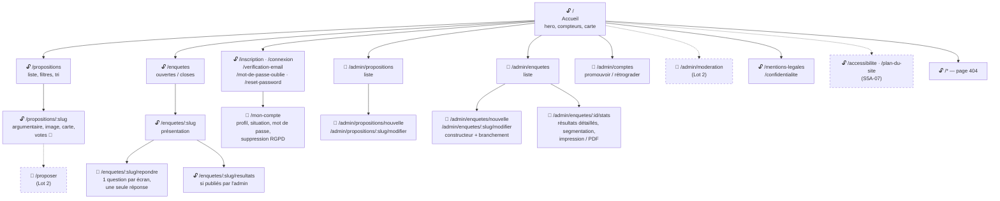

# Sitemap — Senlis Participatif

> Arborescence de navigation, par niveau d'accès : 🔓 public · 🔐 citoyen connecté · 👑 admin. Les nœuds pointillés = prévu (Lot 2 ou audit S5A-07).
>
> **Mise à jour 23/09/2026** : aligné sur `client/src/App.jsx` (branche `dev`). Il n'y a pas de page `/admin` « tableau de bord » : l'admin arrive directement sur ses trois rubriques depuis l'en-tête.

**Principes de navigation**
- **Profondeur maximale : 3 clics** depuis l'accueil pour toute action citoyenne (voter, répondre) — parcours courts, exigence du public senior.
- **Tout le public est consultable sans compte** : on ne demande l'inscription qu'au moment de *participer* (voter, répondre), jamais pour *s'informer*. Un vote tenté sans être connecté est mémorisé (`sessionStorage`) puis rejoué après la connexion.
- **La zone admin est un sous-arbre étanche** : préfixe `/admin`, garde de route côté front (`ProtectedRoute adminOnly`) doublée par le middleware `isAdmin` côté API — la vraie protection est toujours côté serveur.
- Le footer porte les pages légales depuis chaque écran ; il portera aussi « Accessibilité » et « Plan du site » (RGAA 12.1 : deux systèmes de navigation).
