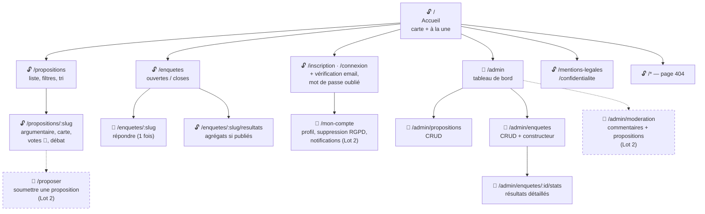

# Sitemap — Senlis Participatif

> Arborescence de navigation, par niveau d'accès : 🔓 public · 🔐 citoyen connecté · 👑 admin. Les nœuds pointillés = Lot 2.

**Principes de navigation**
- **Profondeur maximale : 3 clics** depuis l'accueil pour toute action citoyenne (voter, répondre) — parcours courts, exigence du public senior.
- **Tout le public est consultable sans compte** : on ne demande l'inscription qu'au moment de *participer* (voter, répondre), jamais pour *s'informer*. La barrière est au bon endroit.
- **La zone admin est un sous-arbre étanche** : préfixe `/admin`, garde de route côté front (redirection si non-ADMIN) doublée par le middleware côté API — la vraie protection est toujours côté serveur.
- Le footer porte les pages légales depuis chaque écran (obligation RGPD d'accessibilité permanente).
