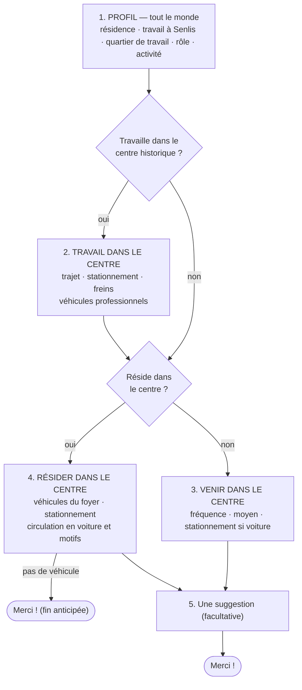

# Enquête « Stationnement et déplacements dans le centre historique » — version 3

> S5R-06 (03/10/2026), d'après la recette du 30/09/2026 (document `23`). Source de vérité : `api/prisma/surveys/stationnement-v3.js` du dépôt de code ; ce document en est la lecture « métier », à présenter à la mairie.
>
> 39 questions au total, mais **chacun ne voit que celles de sa situation** : de 3 questions (résident·e du centre sans véhicule) à une vingtaine (résident·e du centre qui dirige une activité avec des véhicules professionnels).
>
> 🎓 **Analogie** : un plan de métro. Toutes les stations existent, mais chaque voyageur ne parcourt que sa ligne.

## 1. Les parcours

Le bloc « résider dans le centre » est placé **en dernier** : la réponse « pas de véhicule » y termine l'enquête, sans priver la personne d'aucun bloc qui la concerne (un·e résident·e qui travaille dans le centre a déjà répondu au bloc « travail »).

## 2. Ce qui répond à chaque point de la recette

| Retour de recette | Réponse dans la v3 |
|---|---|
| Nombre total de questions décourageant | La page de l'enquête n'annonce plus « 34 questions » mais « questions adaptées à votre situation » ; pendant le questionnaire, « Question X sur N » ne compte que le parcours de la personne |
| Q2 « Travaillez-vous à Senlis ? » non adaptée au profil | Préremplie depuis le profil (oui **ou** non) et l'y enregistre (`travailleASenlis`) |
| 0 véhicule → fin | « Votre foyer possède-t-il un véhicule ? — Non » termine l'enquête |
| Questions clés « optionnelles » | Toutes obligatoires, sauf la suggestion finale |
| Habitants du centre : « Utilisez-vous une voiture… » | Remplacée par « Vous arrive-t-il de circuler en voiture dans le centre ? » → « Pour quelle(s) raison(s) ? » (arrêt minute ≤ 5 min, arrêt plus long, autre motif → « Lequel ? ») → fréquence |
| Plus de cases cochées que de véhicules ; « je n'ai pas de véhicule » | Cases limitées au nombre de véhicules déclaré ; option retirée |
| Véhicules du foyer vs véhicules professionnels | Aide sous la question du foyer : « ne comptez pas les véhicules liés à votre activité » |
| Activité « Autre » → « Laquelle ? » | Ajoutée |
| Véhicules pro « Oui » puis 0 | Minimum 1 ; cases limitées au nombre de véhicules pro |
| Salarié·e d'un autre quartier venant en voiture | Plus de questions sur le stationnement au travail (hors centre) ; à la place, « venez-vous dans le centre ? comment ? » puis le stationnement si en voiture |
| « Précisez cet autre frein » optionnel | Obligatoire ; et une option « Aucun frein : je préfère la voiture » rend la question des freins honnêtement obligatoire |

## 3. Les 39 questions

| # | Question | Type | Affichée si… | Règles |
|---:|---|---|---|---|
| 1 | Où résidez-vous ? | choix unique | toujours | profil : situation |
| 2 | Dans quel quartier ? | choix unique | Q1 = « Un autre quartier de Senlis » | profil : quartier |
| 3 | Dans quelle ville ? | texte libre | Q1 = « Une autre ville » |  |
| 4 | Travaillez-vous ou dirigez-vous une activité à Senlis ? | oui / non | toujours | profil : travailleASenlis |
| 5 | Dans quel quartier travaillez-vous ? | choix unique | Q4 = « Oui » | profil : travailleQuartier |
| 6 | À ce titre… | choix unique | Q4 = « Oui » | profil : travailType |
| 7 | Quel type d'activité (la vôtre, ou celle qui vous emploie) ? | choix unique | Q4 = « Oui » |  |
| 8 | Laquelle ? | texte libre | Q7 = « Autre activité » |  |
| 9 | Comment venez-vous travailler le plus souvent ? | choix unique | Q5 = « Centre historique » |  |
| 10 | Quel autre mode de transport ? | texte libre | Q9 = « Autre » |  |
| 11 | Le véhicule de covoiturage se gare-t-il dans le centre historique ? | oui / non | Q9 = « Covoiturage » |  |
| 12 | Où garez-vous ce véhicule pendant votre travail ? | choix unique | Q9 = « Voiture » **ou** Q11 = « Oui » |  |
| 13 | Rencontrez-vous des difficultés pour vous garer ? | oui / non | Q9 = « Voiture » **ou** Q11 = « Oui » |  |
| 14 | Lesquelles ? | texte libre | Q13 = « Oui » |  |
| 15 | Quels freins vous empêchent de venir travailler sans voiture ? | choix multiple | Q9 = « Voiture » |  |
| 16 | Précisez cet autre frein | texte libre | Q15 = « Autre frein » |  |
| 17 | Utilisez-vous un ou plusieurs véhicules à des fins professionnelles (livraisons, tournées…) ? | oui / non | Q5 = « Centre historique » |  |
| 18 | Combien de véhicules professionnels ? | nombre | Q17 = « Oui » | min 1 |
| 19 | Où sont garés ces véhicules professionnels ? | choix multiple | Q17 = « Oui » | ≤ réponse à Q18 cases |
| 20 | Rencontrez-vous des difficultés pour garer ces véhicules professionnels ? | oui / non | Q17 = « Oui » |  |
| 21 | Lesquelles ? | texte libre | Q20 = « Oui » |  |
| 22 | En dehors de votre éventuel travail, à quelle fréquence venez-vous dans le centre historique ? | choix unique | Q1 = « Un autre quartier de Senlis » **ou** Q1 = « Une autre ville » |  |
| 23 | Le plus souvent, comment venez-vous dans le centre historique ? | choix unique | Q22 = « Tous les jours » **ou** Q22 = « Plusieurs fois par semaine » **ou** Q22 = « Occasionnellement » |  |
| 24 | Quel autre mode de transport ? | texte libre | Q23 = « Autre » |  |
| 25 | Où vous garez-vous le plus souvent ? | choix unique | Q23 = « Voiture » |  |
| 26 | Rencontrez-vous des difficultés pour vous garer ? | oui / non | Q23 = « Voiture » |  |
| 27 | Lesquelles ? | texte libre | Q26 = « Oui » |  |
| 28 | Quels freins vous empêchent de venir sans voiture ? | choix multiple | Q23 = « Voiture » |  |
| 29 | Précisez cet autre frein | texte libre | Q28 = « Autre frein » |  |
| 30 | Votre foyer possède-t-il un ou plusieurs véhicules motorisés ? | oui / non | Q1 = « Le centre historique » | « Non » termine l’enquête |
| 31 | Combien de véhicules motorisés compte votre foyer ? | nombre | Q30 = « Oui » | min 1 |
| 32 | Où sont garés vos véhicules ? | choix multiple | Q30 = « Oui » | ≤ réponse à Q31 cases |
| 33 | Rencontrez-vous des difficultés pour vous garer ? | oui / non | Q30 = « Oui » |  |
| 34 | Lesquelles ? | texte libre | Q33 = « Oui » |  |
| 35 | Vous arrive-t-il de circuler en voiture dans le centre historique ? | oui / non | Q30 = « Oui » |  |
| 36 | Pour quelle(s) raison(s) ? | choix multiple | Q35 = « Oui » |  |
| 37 | Lequel ? | texte libre | Q36 = « Autre motif » |  |
| 38 | À quelle fréquence circulez-vous en voiture dans le centre historique ? | choix unique | Q35 = « Oui » |  |
| 39 | Une suggestion pour le stationnement ou les déplacements dans le centre historique ? | texte libre (optionnelle) | toujours |  |

## 4. Mise en place

- **Production** : `npm run seed:prod` crée cette enquête (ouverte) si aucune enquête ne porte déjà son identifiant (`stationnement-deplacements-centre-historique`).
- **Développement** : l'ancienne version (v2) reste en base avec ses réponses de test ; la v3 est ajoutée à côté. Clore la v2 depuis l'administration pour ne garder que la v3 ouverte.
- **Limite connue du moteur** : pas de « ET » entre deux conditions. Chaque bloc est donc déclenché par une seule question précise (le quartier de travail « Centre historique », la résidence « autre quartier » ou « autre ville »…).
